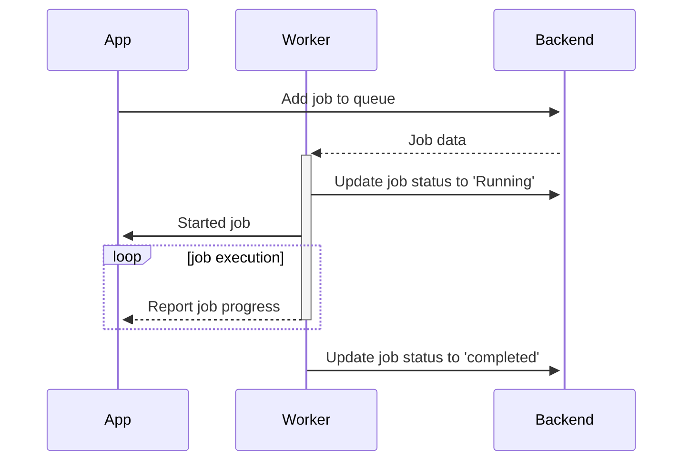

<h1 align="center">apalis</h1>
<div align="center">
 <strong>
   Simple, extensible multithreaded background job and messages processing library for Rust
 </strong>
</div>

<br />

<div align="center">
  <!-- Crates version -->
  <a href="https://crates.io/crates/apalis">
    
  </a>
  <!-- Downloads -->
  <a href="https://crates.io/crates/apalis">
    
  </a>
  <!-- docs.rs docs -->
  <a href="https://docs.rs/apalis">
    
  </a>
  <a href="https://github.com/geofmureithi/apalis/actions">
    
  </a>
</div>
<br/>

## Features

- Simple and predictable task handling model.
- Task handlers are just an async function with a macro free API.
- Familiar dependency injection for task handlers, similar to actix and axum.
- Take full advantage of the [`tower`] ecosystem of middleware, services, and utilities.
- Easy to scale, backends are distributed by default. 
- Runtime agnostic - Use tokio, smol etc.
- Inbuilt concurrency and parallelism.
- Worker monitoring and graceful shutdown.
- Ability to painlessly expose tasks and workers via APIs
- Persisted cron jobs. Pipe your cronjobs to other backends and distribute them.
- Optional Web interface to help you manage your jobs.

apalis job processing is powered by [`tower::Service`] which means you have access to the [`tower`] middleware.

apalis has support for:

| Source       | Crate                                                                                                                 | Example                                                                                                                                                                                  |
| ------------ | --------------------------------------------------------------------------------------------------------------------- | ---------------------------------------------------------------------------------------------------------------------------------------------------------------------------------------- |
| Cron Jobs    | <a href="https://docs.rs/apalis-cron"></a>   | <a href="https://github.com/geofmureithi/apalis/tree/main/examples/async-std-runtime"></a> |
| Redis        | <a href="https://docs.rs/apalis-redis"></a> | <a href="https://github.com/geofmureithi/apalis/tree/main/examples/redis"></a>              |
| Sqlite       | <a href="https://docs.rs/apalis-sql"></a>     | <a href="https://github.com/geofmureithi/apalis/tree/main/examples/sqlite"></a>           |
| Postgres     | <a href="https://docs.rs/apalis-sql"></a>     | <a href="https://github.com/geofmureithi/apalis/tree/main/examples/postgres"></a>     |
| MySQL        | <a href="https://docs.rs/apalis-sql"></a>     | <a href="https://github.com/geofmureithi/apalis/tree/main/examples/mysql"></a>              |
| Amqp         | <a href="https://docs.rs/apalis-amqp"></a>   | <a href="https://github.com/geofmureithi/apalis-amqp/tree/main/examples/basic.rs"></a>  |
| From Scratch | <a href="https://docs.rs/apalis-core"></a>   |                                                                                                                                                                                          |

## Getting Started

To get started, just add to Cargo.toml

```toml
[dependencies]
apalis = { version = "0.7", features = "limit" } # Limit for concurrency
apalis-redis = { version = "0.7" } # Use redis for persistence
```

## Usage

```rust
use apalis::prelude::*;
use apalis_redis::RedisStorage;
use serde::{Deserialize, Serialize};

#[derive(Debug, Deserialize, Serialize)]
struct Email {
    to: String,
}

/// A function called for every job
async fn send_email(job: Email, data: Data<usize>) -> Result<(), Error> {
  /// execute job
  Ok(())
}

#[tokio::main]
async fn main() -> {
    std::env::set_var("RUST_LOG", "debug");
    env_logger::init();
    let redis_url = std::env::var("REDIS_URL").expect("Missing env variable REDIS_URL");
    let conn = apalis_redis::connect(redis_url).await.expect("Could not connect");
    let storage = RedisStorage::new(conn);
    WorkerBuilder::new("email-worker")
      .concurrency(2)
      .data(0usize)
      .backend(storage)
      .build_fn(send_email)
      .run()
      .await;
}
```
Then
```rust
//This can be in another part of the program or another application eg a http server
async fn produce_route_jobs(storage: &mut RedisStorage<Email>) -> Result<()> {
    storage
        .push(Email {
            to: "test@example.com".to_string(),
        })
        .await?;
}
```

### Stepped Tasks

Apalis has beta support for stepped tasks. See [complete example](https://github.com/geofmureithi/apalis/tree/main/examples/stepped-tasks) 

```rs
#[tokio::main]
async fn main() -> Result<(), std::io::Error> {
    std::env::set_var("RUST_LOG", "debug");
    tracing_subscriber::fmt::init();
    let redis_url = std::env::var("REDIS_URL").expect("Missing env variable REDIS_URL");
    let conn = apalis_redis::connect(redis_url).await.unwrap();
    let config = apalis_redis::Config::default().set_namespace("stepped-email-task");


    let mut storage = RedisStorage::new_with_config(conn, config);
    storage
        .start_stepped(WelcomeEmail { user_id: 1 })
        .await
        .unwrap();

    // Build steps
    let steps = StepBuilder::new()
        .step_fn(welcome) // Steps are tower services
        .step_fn(campaign)
        .step_fn(complete_campaign);

    WorkerBuilder::new("tasty-banana")
        .data(()) // Shared data for all steps
        .enable_tracing()
        .concurrency(2)
        .backend(storage)
        .build_stepped(steps)
        .on_event(|e| info!("{e}"))
        .run()
        .await;
    Ok(())
}
```

## Feature flags

- _tracing_ (enabled by default) — Support Tracing 👀
- _sentry_ — Support for Sentry exception and performance monitoring
- _prometheus_ — Support Prometheus metrics
- _retry_ — Support direct retrying jobs
- _timeout_ — Support timeouts on jobs
- _limit_ — 💪 Support for concurrency and rate-limiting
- _filter_ — Support filtering jobs based on a predicate
- _catch-panic_ - Catch panics that occur during execution

## Storage Comparison

Since we provide a few storage solutions, here is a table comparing them:

| Feature         | Redis | Sqlite | Postgres | Sled | Mysql | Mongo | Cron |
| :-------------- | :---: | :----: | :------: | :--: | :---: | :---: | :--: |
| Scheduled jobs  |   ✓   |   ✓    |    ✓     |  x   |   ✓   |   x   |  ✓   |
| Retry jobs      |   ✓   |   ✓    |    ✓     |  x   |   ✓   |   x   |  ✓   |
| Persistence     |   ✓   |   ✓    |    ✓     |  x   |   ✓   |   x   | BYO  |
| Rerun Dead jobs |   ✓   |   ✓    |    ✓     |  x   |   ✓   |   x   |  x   |

## How apalis works

Here is a basic example of how the core parts integrate



## External examples

- [Shuttle](https://github.com/shuttle-hq/shuttle-examples/tree/main/shuttle-cron): Using apalis-cron with [shuttle.rs](https://shuttle.rs)
- [Actix-Web](https://github.com/actix/examples/tree/master/background-jobs): Using apalis-redis with actix-web
- [Zino-Example](https://github.com/apalis-dev/zino-example): Using [zino](https://crates.io/crates/zino)

## Projects using apalis

- [Ryot](https://github.com/IgnisDa/ryot): A self hosted platform for tracking various facets of your life - media, fitness etc.
- [Summarizer](https://github.com/akhildevelops/summarizer): Podcast summarizer
- [Universal Inbox](https://github.com/universal-inbox/universal-inbox): Universal Inbox is a solution that centralizes all your notifications and tasks in one place to create a unique inbox.
- [Hatsu](https://github.com/importantimport/hatsu): Self-hosted and fully-automated ActivityPub bridge for static sites.

## Resources

- [Background job processing with rust using actix and redis](https://mureithi.me/blog/background-job-processing-with-rust-actix-redis)
- [Feasibility of implementing cronjob with Rust programming language](https://tpbabparn.medium.com/feasibility-of-implementing-cronjob-with-rust-programming-language-186eaed0a7d8)
- [How to schedule and run cron jobs in Rust using apalis](https://dev.to/njugunamureithi/how-to-schedule-and-run-cron-jobs-in-rust-5106)

### Web UI

If you are running [apalis Board](https://github.com/geofmureithi/apalis-board), you can easily manage your jobs. See a working [rest API example here](https://github.com/geofmureithi/apalis/tree/main/examples/rest-api)


## Thanks to

- [`tower`] - Tower is a library of modular and reusable components for building robust networking clients and servers.
- [redis-rs](https://github.com/mitsuhiko/redis-rs) - Redis library for rust
- [sqlx](https://github.com/launchbadge/sqlx) - The Rust SQL Toolkit
- [cron](https://docs.rs/cron/latest/cron/) - A cron expression parser and schedule explorer

## Contributing

Please read [CONTRIBUTING.md](CONTRIBUTING.md) for details on our code of conduct, and the process for submitting pull requests to us.

## Versioning

We use [SemVer](http://semver.org/) for versioning. For the versions available, see the [tags on this repository](https://github.com/geofmureithi/apalis/tags).

## Authors

- **Njuguna Mureithi** - _Initial work_ - [Njuguna Mureithi](https://github.com/geofmureithi)

See also the list of [contributors](https://github.com/geofmureithi/apalis/contributors) who participated in this project.

## License

This project is licensed under the MIT License - see the [LICENSE.md](LICENSE.md) file for details

[`tower::Service`]: https://docs.rs/tower/latest/tower/trait.Service.html
[`tower`]: https://crates.io/crates/tower
[`actix`]: https://crates.io/crates/actix
