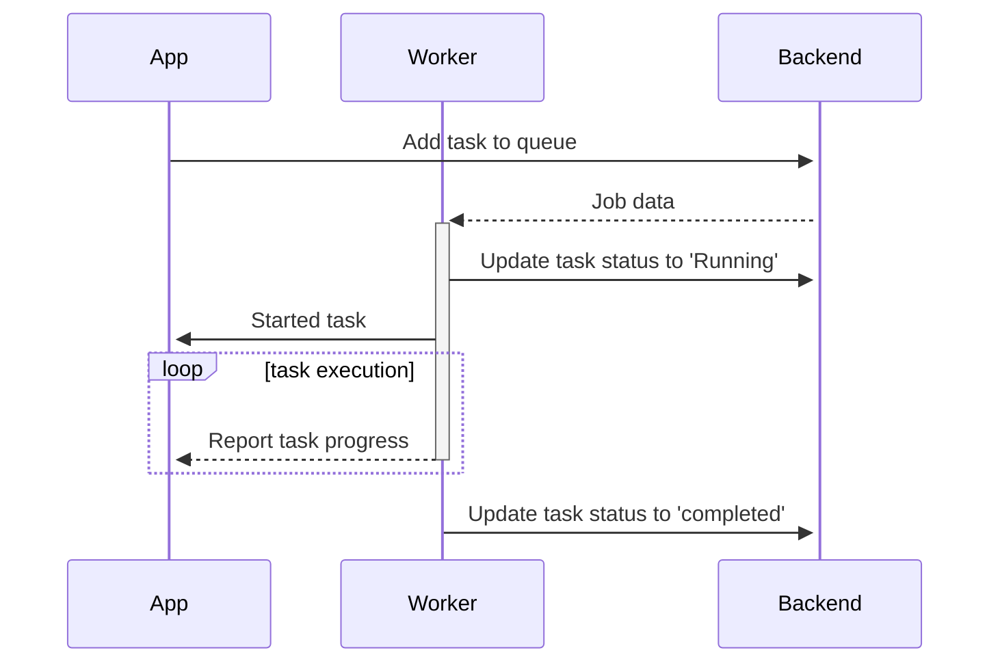

<h1 align="center">apalis</h1>
<div align="center">
 <strong>
   Simple, extensible multithreaded background task and messages processing library for Rust
 </strong>
</div>

<br />

<div align="center">
  <!-- Crates version -->
  <a href="https://crates.io/crates/apalis">
    
  </a>
  <!-- Downloads -->
  <a href="https://crates.io/crates/apalis">
    
  </a>
  <!-- docs.rs docs -->
  <a href="https://docs.rs/apalis">
    
  </a>
  <a href="https://github.com/geofmureithi/apalis/actions">
    
  </a>
</div>
<br/>

## Features

- **Simple and predictable task handling** - Task handlers are just async functions with a macro-free API
- **Familiar dependency injection** - Similar to popular frameworks like [`actix`] and [`axum`]
- **Robust task execution** - Built-in support for retries, delays, timeouts, and error handling
- **Extensible middleware system** - Take full advantage of the [`tower`] ecosystem of services and utilities
- **Multiple storage backends** - Support for Redis, PostgreSQL, SQLite, and in-memory storage
- **Advanced task management** - Task prioritization, scheduling, metadata, and result tracking
- **Scalable by design** - Distributed backends with configurable concurrency and multi-threaded execution
- **Runtime agnostic** - Works with tokio, async-std, and other async runtimes
- **Production ready** - Built-in monitoring, metrics, graceful shutdown, and comprehensive error reporting
- **Developer friendly** - Easy integration with existing applications and rich ecosystem of extensions
- **Optional web interface** - Manage and monitor your tasks through a web UI

apalis has support for:

| Source       | Crate                                                                                                                 | Example                                                                                                                                                                                |
| ------------ | --------------------------------------------------------------------------------------------------------------------- | -------------------------------------------------------------------------------------------------------------------------------------------------------------------------------------- |
| Cron Jobs    | <a href="https://docs.rs/apalis-cron"></a>   | <a href="https://github.com/geofmureithi/apalis/tree/main/examples/async-std-runtime"></a> |
| Redis        | <a href="https://docs.rs/apalis-redis"></a> | <a href="https://github.com/geofmureithi/apalis/tree/main/examples/redis"></a>              |
| Sqlite       | <a href="https://docs.rs/apalis-sql"></a>     | <a href="https://github.com/geofmureithi/apalis/tree/main/examples/sqlite"></a>           |
| Postgres     | <a href="https://docs.rs/apalis-sql"></a>     | <a href="https://github.com/geofmureithi/apalis/tree/main/examples/postgres"></a>     |
| MySQL        | <a href="https://docs.rs/apalis-sql"></a>     | <a href="https://github.com/geofmureithi/apalis/tree/main/examples/mysql"></a>              |
| Amqp         | <a href="https://docs.rs/apalis-amqp"></a>   | <a href="https://github.com/geofmureithi/apalis-amqp/tree/main/examples/basic.rs"></a>  |
| From Scratch | <a href="https://docs.rs/apalis-core"></a>   |                                                                                                                                                                                        |

## Getting Started

To get started, just add to Cargo.toml

```toml
[dependencies]
apalis = { version = "1.0.0-beta.1" }
apalis-redis = { version = "1.0.0-alpha.1" } # Use redis for persistence
```

## Usage

```rust,ignore
use apalis::prelude::*;
use apalis_redis::RedisStorage;
use serde::{Deserialize, Serialize};

#[derive(Debug, Deserialize, Serialize)]
struct Email {
    to: String,
}

/// A function called for every task
async fn send_email(task: Email, data: Data<usize>) {
  // execute task
}


#[tokio::main]
async fn main() {
    let redis_url = std::env::var("REDIS_URL").expect("Missing env variable REDIS_URL");
    let conn = apalis_redis::connect(redis_url).await.expect("Could not connect");
    
    let mut storage = RedisStorage::new(conn);
     storage
        .push(Email {
            to: "test@example.com".to_string(),
        })
        .await.expect("Could not add tasks");

    WorkerBuilder::new("email-worker")
      .backend(storage)
      .concurrency(2)
      .parallelize(tokio::spawn)
      .data(0usize)
      .build(send_email)
      .run()
      .await;
}
```

## Feature flags

- _full_ - All the available features
- _tracing_ (enabled by default) — Support Tracing 👀
- _sentry_ — Support for Sentry exception and performance monitoring
- _prometheus_ — Support Prometheus metrics
- _retry_ — Support direct retrying tasks
- _timeout_ — Support timeouts on tasks
- _limit_ — Support for concurrency and rate-limiting
- _filter_ — Support filtering tasks based on a predicate
- _catch-panic_ - Catch panics that occur during execution

## Storage Comparison

Since we provide a few storage solutions, here is a table comparing them:

| Feature          | Redis | Sqlite | Postgres | Sled | Mysql | Mongo | Cron |
| :--------------- | :---: | :----: | :------: | :--: | :---: | :---: | :--: |
| Scheduled tasks  |   ✓   |   ✓    |    ✓     |  x   |   ✓   |   x   |  ✓   |
| Retry tasks      |   ✓   |   ✓    |    ✓     |  x   |   ✓   |   x   |  ✓   |
| Persistence      |   ✓   |   ✓    |    ✓     |  x   |   ✓   |   x   | BYO  |
| Rerun Dead tasks |   ✓   |   ✓    |    ✓     |  x   |   ✓   |   x   |  x   |

## How apalis works

Here is a basic example of how the core parts integrate



## Integrations

- [zino](https://crates.io/crates/zino-core): Next-generation framework for composable applications in Rust.
- [spring-rs](https://github.com/spring-rs/spring-rs): Application framework written in Rust, inspired by Java's SpringBoot

## Projects using apalis

- [Ryot](https://github.com/IgnisDa/ryot): A self hosted platform for tracking various facets of your life - media, fitness etc.
- [Hyprnote](https://github.com/fastrepl/hyprnote): Local-first AI Notepad for Private Meetings
- [oxy](https://github.com/oxy-hq/oxy): A framework for building SQL agents and automations for analytics.
- [OpenZeppelin Relayer](https://github.com/OpenZeppelin/openzeppelin-relayer): OpenZeppelin relayer service
- [Summarizer](https://github.com/akhildevelops/summarizer): Podcast summarizer
- [Universal Inbox](https://github.com/universal-inbox/universal-inbox): Universal Inbox is a solution that centralizes all your notifications and tasks in one place to create a unique inbox.
- [Hatsu](https://github.com/importantimport/hatsu): Self-hosted and fully-automated ActivityPub bridge for static sites.
- [Stamon](https://github.com/krivahtoo/stamon): A lightweight self-hosted status monitoring tool
- [Gq](https://github.com/jorgehermo9/gq): open-source filtering tool for JSON and YAML files

## External examples

- [Shuttle](https://github.com/shuttle-hq/shuttle-examples/tree/main/shuttle-cron): Using apalis-cron with [shuttle.rs](https://shuttle.rs)
- [Actix-Web](https://github.com/actix/examples/tree/master/background-jobs): Using apalis-redis with actix-web
- [Zino-Example](https://github.com/apalis-dev/zino-example): Using [zino](https://crates.io/crates/zino)

## Resources

- [Background job processing with rust using actix and redis](https://mureithi.me/blog/background-job-processing-with-rust-actix-redis)
- [Feasibility of implementing cronjob with Rust programming language](https://tpbabparn.medium.com/feasibility-of-implementing-cronjob-with-rust-programming-language-186eaed0a7d8)
- [How to schedule and run cron jobs in Rust using apalis](https://dev.to/njugunamureithi/how-to-schedule-and-run-cron-jobs-in-rust-5106)

### Web UI

If you are running the [web UI](https://github.com/apalis-dev/apalis-board), you can easily manage your jobs. See a working [rest API example here](https://github.com/apalis-dev/apalis-board/blob/master/examples/axum-email-service)


## Thanks to

- [`tower`] - Tower is a library of modular and reusable components for building robust networking clients and servers.
- [`redis-rs`](https://github.com/mitsuhiko/redis-rs) - Redis library for rust
- [`sqlx`](https://github.com/launchbadge/sqlx) - The Rust SQL Toolkit
- [`cron`](https://docs.rs/cron/latest/cron/) - A cron expression parser and schedule explorer

## Contributing

Please read [CONTRIBUTING.md](CONTRIBUTING.md) for details on our code of conduct, and the process for submitting pull requests to us.

## Versioning

We use [SemVer](http://semver.org/) for versioning. For the versions available, see the [tags on this repository](https://github.com/geofmureithi/apalis/tags).

## Contributors

See also the list of [contributors](https://github.com/geofmureithi/apalis/contributors) who participated in this project.

## License

This project is licensed under the MIT License - see the [LICENSE.md](LICENSE.md) file for details

[`tower::Service`]: https://docs.rs/tower/latest/tower/trait.Service.html
[`tower`]: https://crates.io/crates/tower
[`actix`]: https://crates.io/crates/actix
[`axum`]: https://crates.io/crates/axum
